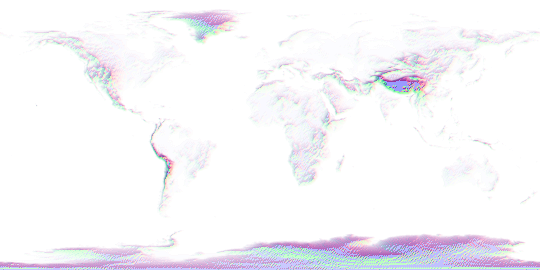

# Earth heightmap normal calulator

A simple tool for creating normal maps from height maps. Used in [this project of mine](https://github.com/doleckijakub/java-game).

## Example usage

```console
./earth-heightmap-normal-calculator heightmap.png output.png
```

<table>
  <tr><th>Before</th><th>After</th></tr>
  <tr><td></td><td></td></tr>
</table>
